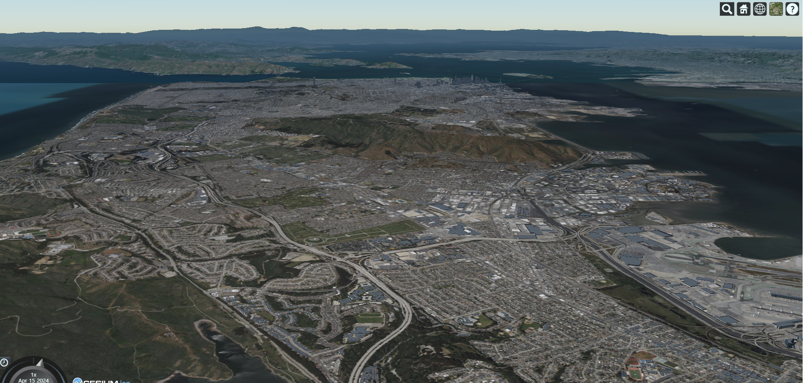

# step1 : Create an account and get a token

<a href="https://ion.cesium.com/signup">Access Token 발급 </a> 에서 키를 발급받기

# step2 : Set up the CesiumJS client

방법으로는 `import from CDN` ,`install with NPM` 방식이 있다. 
나는 `import from CDN`방식으로 진행한다.

공식문서에 있는 코드를 복사해서 넣어주고 `토큰을 넣기`에 복사해둔 토큰을 넣어준다. 
```HTML
<!DOCTYPE html>
<html lang="en">
<head>
  <meta charset="utf-8">
  <!-- Include the CesiumJS JavaScript and CSS files -->
  <script src="https://cesium.com/downloads/cesiumjs/releases/1.116/Build/Cesium/Cesium.js"></script>
  <link href="https://cesium.com/downloads/cesiumjs/releases/1.116/Build/Cesium/Widgets/widgets.css" rel="stylesheet">
</head>
<body>
  <div id="cesiumContainer"></div>
  <script type="module">
    // Your access token can be found at: https://ion.cesium.com/tokens.
    // This is the default access token from your ion account

    Cesium.Ion.defaultAccessToken = '토큰을 넣기';

    // Initialize the Cesium Viewer in the HTML element with the `cesiumContainer` ID.
    const viewer = new Cesium.Viewer('cesiumContainer', {
      terrain: Cesium.Terrain.fromWorldTerrain(),
    });    

    // Fly the camera to San Francisco at the given longitude, latitude, and height.
    viewer.camera.flyTo({
      destination: Cesium.Cartesian3.fromDegrees(-122.4175, 37.655, 400),
      orientation: {
        heading: Cesium.Math.toRadians(0.0),
        pitch: Cesium.Math.toRadians(-15.0),
      }
    });

    // Add Cesium OSM Buildings, a global 3D buildings layer.
    const buildingTileset = await Cesium.createOsmBuildingsAsync();
    viewer.scene.primitives.add(buildingTileset);   
  </script>
 </div>
</body>
</html>
```



이미지가 나왔다면 성공!!